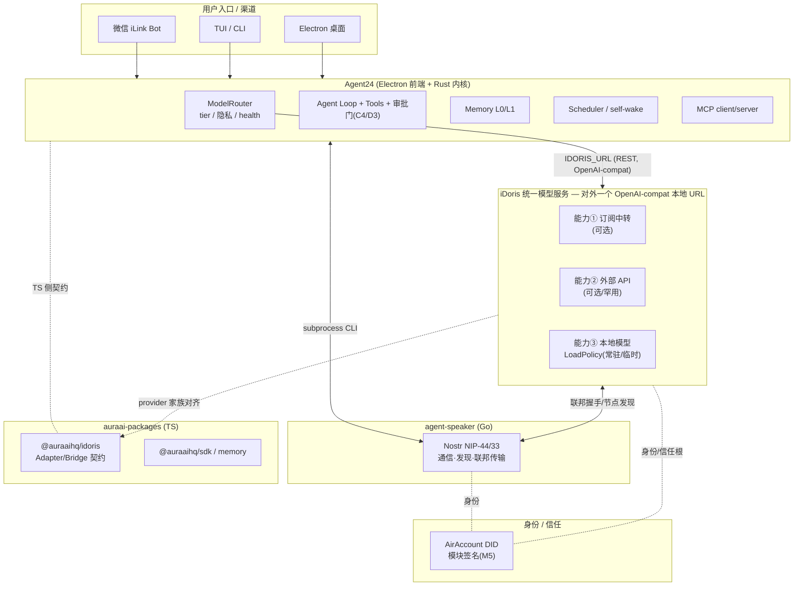
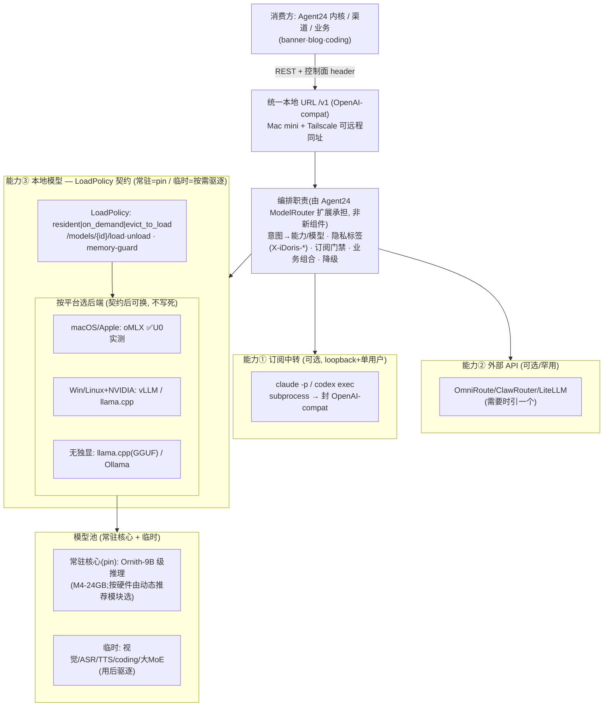
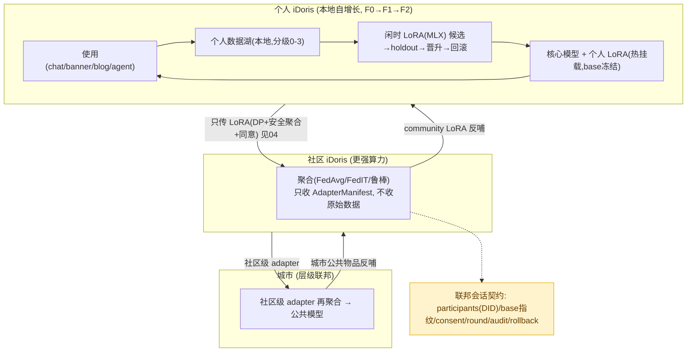
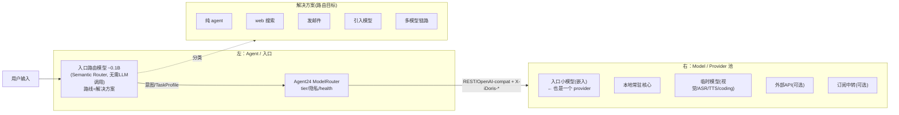

# iDoris 架构图 —— 生态蓝图

> 文档类型：架构图（Mermaid，GitHub/IDE 直接渲染）
> 日期：2026-07-30 ｜ 维护者：iDoris.ai / @jhfnetboy
> 关联：[01](./01-统一模型服务-架构设计.md) / [05](./05-集成与技术栈协调规划.md) / [06](./06-组件接口契约与互换标准.md)
>
> 三张图：① 生态蓝图（iDoris 与 Agent24 / agent-speaker / auraai-packages 的关系）② iDoris 统一模型服务内部（三能力 + 跨平台后端）③ 自增长与联邦（个人→社区→城市）。

---

## 图 1：生态蓝图（谁是谁、谁调谁）

**读法**：渠道 → Agent24 内核 → 经 `IDORIS_URL`(REST) 调 iDoris 统一服务；iDoris 内部三能力;去中心通信/联邦走 agent-speaker(Nostr);身份走 AirAccount DID;TS 侧契约由 @auraaihq/idoris 承载。**普通话 = OpenAI-compat + Nostr + DID。**

---

## 图 2：iDoris 统一模型服务内部（三能力 + 跨平台后端）

**要点**：① 编排是 **Agent24 ModelRouter 扩展的职责,不是新写的 router**;② capability③ = LoadPolicy 契约,**oMLX 只是 macOS 实现**,Win/Linux 换 vLLM/llama.cpp;③ 常驻=pin、临时=按需驱逐(U0 实测);④ 具体模型由动态推荐模块按硬件选。

---

## 图 3：自增长与联邦（个人 → 社区 → 城市）

**要点**：base 冻结、**只传 LoRA(几十MB)**、同 base 指纹才聚合;隐私靠 DP+安全聚合+同意(F1 才准真实数据);同一机制**分形**复用到个人/社区/城市。⚠️ "只传 LoRA ≠ 天然隐私"(见 [04](./04-联邦学习挑战-技术伦理法律基础设施.md))。

---

## 图 4：入口路由（左 agent）× 模型（右）—— 2026-07-30 新增

> 新增架构组件：**入口路由模型**（~0.1B，基于成熟开源 Semantic Router，非自造）。按用户输入动态决定**解决方案**（纯 agent / 搜索 / 发邮件 / 引哪个模型 / 多模型链路）。它在**左侧(agent/入口)**，同时也是 provider 池里的一个 model(右)。**实现归属 Agent24**（前端用户交互入口），见 [`Agent24/docs/iDoris-integration-and-entry-router.md`]。

> 关键：入口小模型**一物两面**——左侧用它的**决策**(路由)，右侧它是 provider 池里的一个 **model**。这与用户的架构直觉一致（模型在右、agent 在左）。

---

## 跨仓库职责边界（一句话各归各）

| 仓库 | 职责 | 与 iDoris 的接口 |
|---|---|---|
| **Agent24** (Rust+TS) | 内核:agent loop/审批/记忆/调度/**ModelRouter**;Electron 壳;跨平台分发 | ModelRouter 经 `IDORIS_URL`(REST) 消费 iDoris;编排职责在此扩展 |
| **iDoris** | 统一模型服务定义(三能力契约 + LoadPolicy + 动态推荐 + 联邦设计) | 本仓库(设计+服务) |
| **agent-speaker** (Go) | Nostr 通信/发现/联邦传输 | subprocess CLI + Nostr 事件 |
| **auraai-packages** (TS) | @auraaihq/idoris 网关契约、sdk、memory | provider 家族/Adapter 契约对齐 |
| **AirAccount** | DID 身份 + 模块签名信任根 | 联邦/社区互认 |

> **底线**：iDoris 定契约与服务;**不越界改 Agent24 内核**(ModelRouter 扩展由 Agent24 自己做,iDoris 只提需求 → 见 [09](./09-对Agent24的需求.md))。
